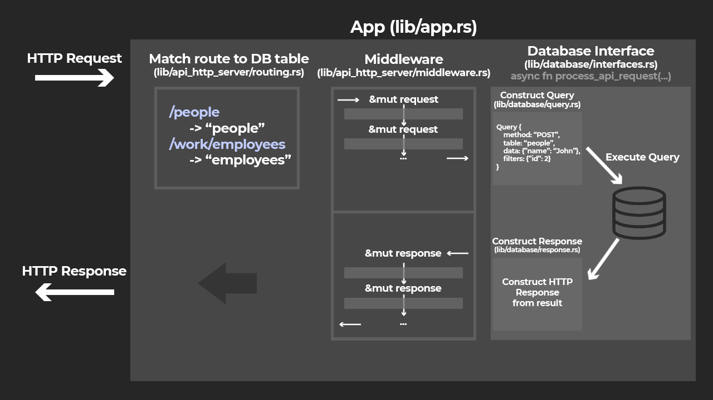

<p align="center">
    
</p>

# **No-code REST API server**

## Table of Contents
  + [<u>**Using the binary**</u>](#using-the-binary)
    + [**Config file**](#config-file)
        + [Specifying database tables](#specifying-database-tables)
    + [**Command Line Options**](#command-line-options)
    + [**API Format**](#api-format)
      + [GET Requests](#get-requests)
      + [POST Requests](#post-requests)
      + [DELETE Requests](#delete-requests)
      + [PATCH Requests](#patch-requests)
  + [<u>**Using the library**</u>](#using-the-library)
    + [**Miscellaneous**](#miscellaneous)
    + [**Flow of received HTTP requests in the app**](#flow-of-received-http-requests-in-the-app)
    + [**Adding middleware**](#adding-middleware)
    + [**Adding a new database implementation**](#adding-a-new-database-implementation)
      + [Interface : *Required*](#interface--required)
      + [Query](#query)
      + [ResponseBuilder](#responsebuilder)

<br/>

# **Using the binary**
An API can be setup using the server_config.toml

## **Config file**
The config file uses the [TOML](https://toml.io/en/) format.  
A typical config file looks like:
```toml
database="sqlite3"
database_path="database.db"
loglevel="debug"

# Example table
[table.people]
route = "/people"
name = "text"
age = "Integer"
```

*Currently only `database="sqlite3"` is supported*

```database_path```  
Path where the database will be opened/saved to. This can be absolute or relative.

```loglevel```  
This can be a value of:
- `error`
- `warn`
- `info`
- `debug`
- `trace`
- `off`

### **Specifying database tables**
```[table.name]```  
This creates a table with `name`.

```route = "/uri_to_table"```  
This is a required attribute for each table. The table will be accessed at the URL `/uri_to_table` .

```field = "type"```  
The remaining attributes specify the structure of the table.  
`field` is the name of a field, or column.  
`type` is the data type of the field. In sqlite3, the following types are supported:
- `null`
- `real`
- `integer`
- `text`

***A primary key `id` is automatically added for every table.***

## **Command Line Options**
`-c --config <FILE>`  
Sets the path to a custom config file

`-r --resetdb`  
Reset the database before starting server

## **API Format**
The API uses [JSON](https://www.json.org/json-en.html) format to receive and send data.

### **GET Requests**
#### **Sending**  
Sending a GET request to a table's route will retrieve all entries.  
Query strings can be used to filter the results.  
`/people?age=4` will translate to SQL `SELECT * FROM people WHERE age=4`  
`+` in query strings are translated to a space.  

#### **Returning**
A JSON string containing an array of returned results.  
Each result is an ordered array containing each field. The first field is the unique id.

**Examples:**
```
curl 127.0.0.1:3000/people
    => [[1,"john",5],[2,"jess",19],[3,"mike",56]]

curl 127.0.0.1:3000/people?id=2
    => [[2,"john",8]]

curl 127.0.0.1:3000/people?age=43
    => [[4,"john",43],[13,"andrew",43]]
```

### **POST Requests**
Used to add new database entries.
#### **Sending**
A POST request must contain a JSON body. The format of the body is
```json
{
    "columns": {
        "name": "john",
        "age": "8"
    }
}
```
*All values in "columns" must be a string.*  
*All fields for a table must be specified (except id).*
#### **Returning**
A JSON string containing an array of the most recently added values. This is in the same format as GET returns.

**Examples:**
```
curl -X POST -d @test.json 127.0.0.1:3000/people
    => [[1,"john",8]]

curl -X POST -d @test.json 127.0.0.1:3000/people
    => [[2,"john",8]]
```

### **DELETE Requests**
Used to delete database entries.
#### **Sending**
Sending a delete request to a table's route will delete the table.  
Query strings can be used to filter which entries are deleted.  
`/people?age=4` will translate to SQL `DELETE FROM people WHERE age=4`  
`+` in query strings are translated to a space.

#### **Returning**
Empty body.  
If an error is encountered when deleting, HTTP error code 500 will be returned. It cannot be assumed the entry was deleted successfully.  
Else, HTTP 200.

### **PATCH Requests**
Used to update database entries.
#### **Sending**
A PATCH request must contain a JSON body. The format of the body is
```json
{
    "columns": {
        "name": "jeff",
    },
    "filters": {
        "age": "8"
    }
}
```
*All values in "columns" and "filters" must be a string.*  

This will update all columns' `name` to the value `"jeff"` for all entries that match `age=8`.

#### **Returning**
Empty body.  
If an error is encountered when updating, HTTP error code 500 will be returned. It cannot be assumed any values were updated successfully.
Else, HTTP 200.

<br>

# **Using the library**
## A basic implementation (used for the binary) can be found [here](/src/bin.rs).

## **Miscellaneous**

**The config TOML file is parsed with:**  
```rust
let (config, tables) = rest_api::config_parser::read_config(optional_path)
```

**Logging is enabled by calling:**  
```rust
rest_api::enable_logging(&config)
```
*Call once only*  


**An app is asynchronously run with:**
```rust
rest_api::api_http_server::http::run_app_server(addr, app).await
```
*This requires the parent function to be async*

## **Flow of received HTTP requests in the app**:


## **Adding middleware**
The easiest way to add functionality is to create your own [`App`](/src/lib/app.rs) with your own [`middleware`](/src/lib/api_http_server/middleware.rs).  
This allows every request and response to be intercepted and processed.  
To create a middleware, create a struct that implements the Middleware trait, as well as Sync and Send for thread safety.  
Middlewares are registered when creating the `App` object. For reference, [bin.rs](/src/bin.rs) shows how an app is created.  
Example:
```rust
// create_auth_middleware() must return a struct that implements the Middleware + Send + Sync traits.
let auth_middleware = Box::new( create_auth_middleware() ) as Box<dyn Middleware + Send + Sync>;

let app = App {
    routes,
    middleware: vec![auth_middleware],
    database_interface: Box::new(interface)
};

```

### **Adding a new database implementation**
To support a new database type, the following things must be implemented:

#### **Interface : *Required***
The [interface](/src/lib/database/interfaces.rs) acts as a 'bridge' between the incoming requests and the database.  
It also handles other database functions such as deleting, creating and connecting.  
An interface struct implements the DatabaseInterface trait.  
Due to the `async` requirement for processing the request, the implementation of the trait must use `#[async_trait::async_trait]`, from the [async_trait](https://docs.rs/async-trait/latest/async_trait/) crate.  

The supported data types are in the `SQLType` enum:
```rust
pub enum SQLType {
    Null,
    Integer,
    Real,
    Text,
}
```

#### **Query**
The [query](/src/lib/database/query.rs) is an optional trait that can help with converting requests to SQL. It is used in the SQLite3 implementation for parsing request data and safely executing SQL.  
It has 2 generics `<T, A>`.  
`T` is a database connection.  
`A` is a cursor returned from executing a statement.

#### **ResponseBuilder**
The [response builder](/src/lib/database/response.rs) is an optional trait that defines a function to convert a query result `Vec<Vec<T>>` (where `T` is a database value) into a string for a response.  
The outer `Vec` contains the rows, and the inner `Vec` contains the fields in a row.
